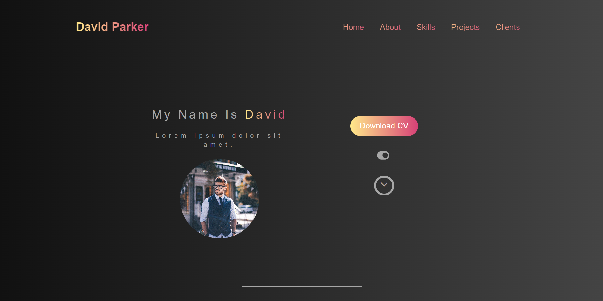
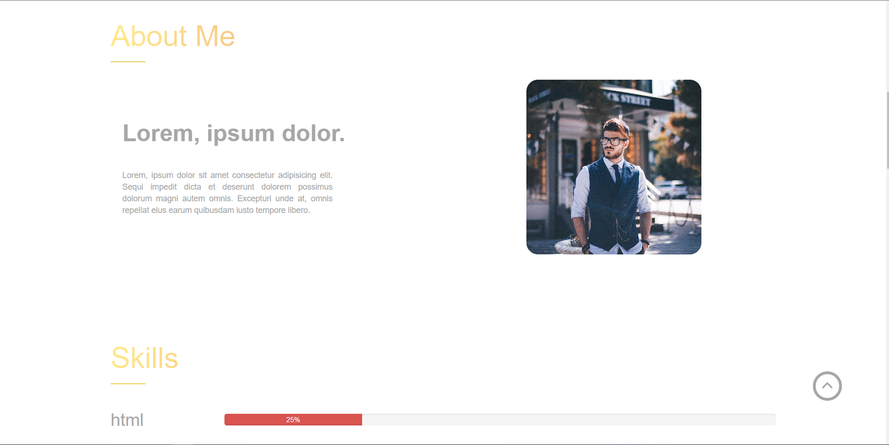
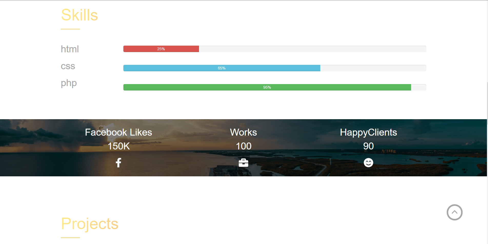
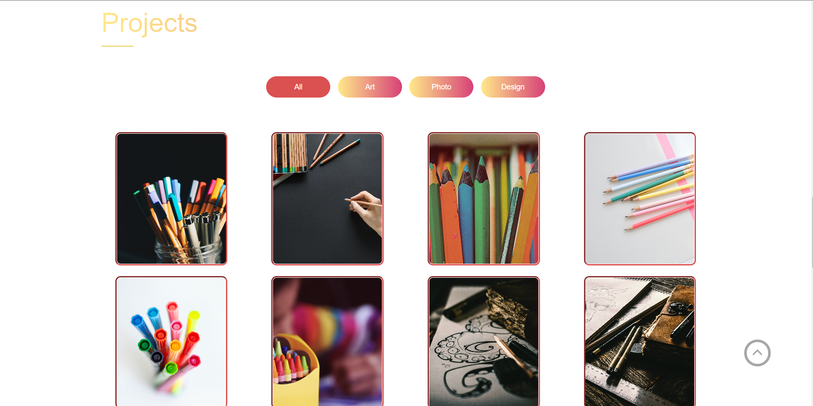
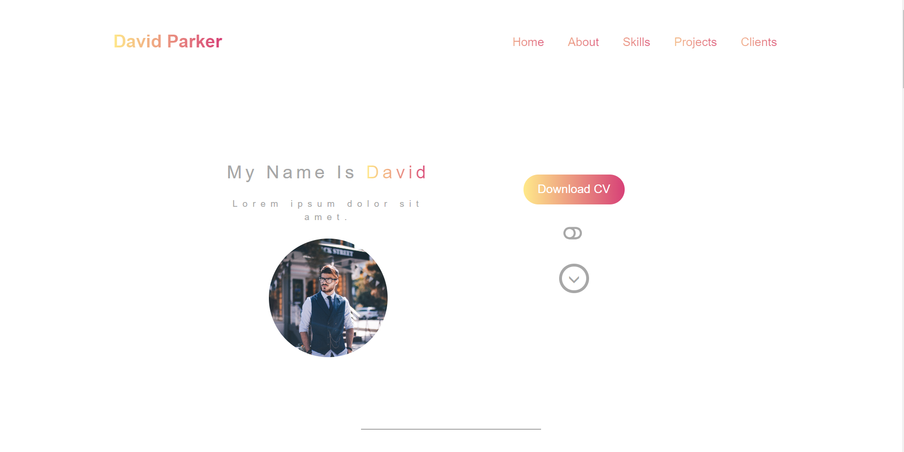
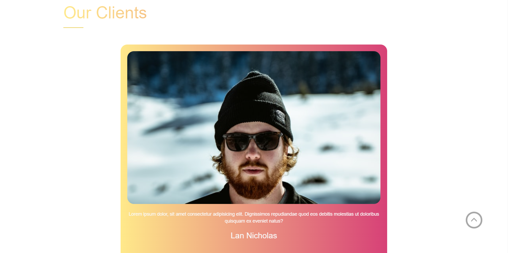
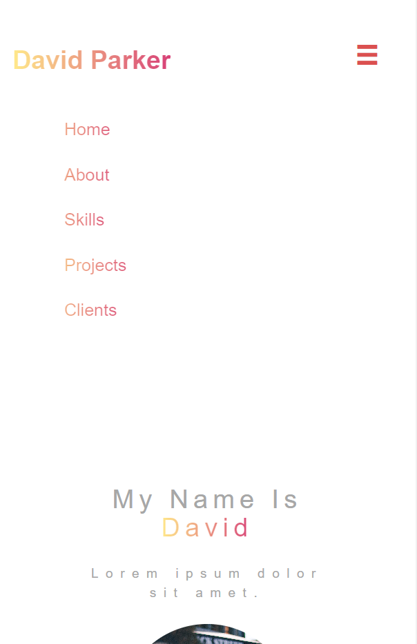

# Portfolio---website-with-JavaScript

<h2>About project :- </h2>

Portfolio website is a project for personal website 

 
<h2>Technical skills :-</h2>
<ul>
   <li>Bootstrap</li>
   <li>SASS</li>
   <li>JS DOM</li>
</ul>

 

 

 

 

 

 

 

<h2>Features :-</h2>
<ul>
   <li>Dark / Light switch</li>
   <li>Filter gallery</li>
   <li>Counter</li>
   <li>Scroll top button</li>
   <li>Scroll bottom button</li>
   <li>carousel</li>
</ul>

